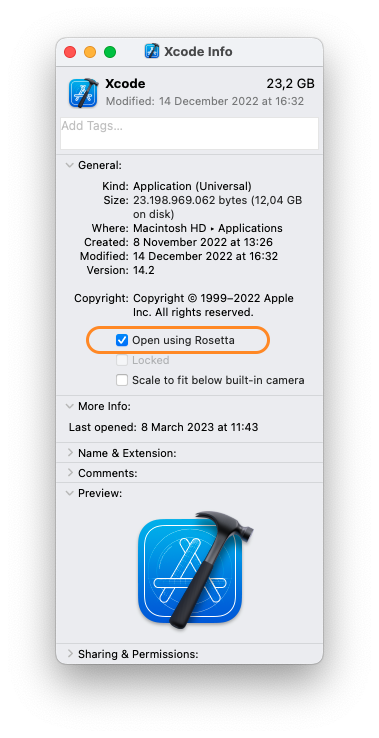

# Contributing to mistica-ios

Thank you for your interest in Mística. You can contribute to this project in several ways:

Feel free to contact maintainers at the
[Mística Teams Channel](https://teams.microsoft.com/l/channel/19%3ad2e3607a32ec411b8bf492f43cd0fe0c%40thread.tacv2/General?groupId=e265fe99-929f-45d1-8154-699649674a40&tenantId=9744600e-3e04-492e-baa1-25ec245c6f10).
Don't hesitate to ask any questions and share your ideas

* [Pull Requests](#pull-requests)
  * [Release workflow](#release-workflow)
  * [Commit messages](#commit-messages)
* [Bug reports](#bug-reports)
* [Feature requests (no UI/UX changes)](#feature-requests--no-ui-ux-changes-)
* [Documentation and help requests](#documentation-and-help-requests)
* [New component proposals or UI/UX changes](#new-component-proposals-or-ui-ux-changes)
* [How to work with mistica-ios](#how-to-work-with-mistica-ios)
* [Testing](#testing)

## Pull Requests

We would love to accept your Pull Requests but please, before starting your development,
[create an issue](https://github.com/Telefonica/mistica-ios/issues/new/choose).

When selecting the reviewers for your pull request, use the `Telefonica/iOS` team as it will automatically select two reviewers from the team.

Pull request will be merged by the repo owners by squashing all commits and combining them into one that will have a meaningful message following the ["Commit messages"](#commit-messages) guidelines.

### Release workflow

To create a new release, use the GitHub action `Release`. The process is automated using [semantic-release](https://github.com/semantic-release/semantic-release), which will increase version numbers, update the CHANGELOG.md and create a new GitHub release. 

### Commit messages

**semantic-release** uses the uses [Angular Commit Message Conventions](https://github.com/angular/angular.js/blob/master/DEVELOPERS.md#-git-commit-guidelines) to determine the type release to generate. The following list includes some examples of commit messages and the type of release that will be created:

| Commit message                                                                                        | Release type               |
|-------------------------------------------------------------------------------------------------------|----------------------------|
| `fix(Button): make it green again in MovistarES`                                                      | Patch Release              |
| `feat(Button): added a new fancy animation`                                                           | Minor Release              |
| `feat(FontStyle): update font styles`<br><br>`BREAKING CHANGE: The existing font style has changed.`  | Major Release              |

> In order for a feature/fix to be considered a major release, it needs to include the `BREAKING CHANGE:` body in the commit message. Refer the the full list of commit message types [here](https://github.com/angular/angular.js/blob/master/DEVELOPERS.md#-git-commit-guidelines).


To revert a commit, the commit message should begin with `revert:`, followed by the header of the reverted commit. In the body it should say: `This reverts commit <hash>`, where the hash is the SHA of the commit being reverted. **semantic-release** will automatically skip the original and the revert commit from the `CHANGELOG.md` if the release has not been yet created, if not, it will create a new one.

```
revert: fix(Button): make it green again in MovistarES

This reverts commit c3cdc70e88dc0bf9de849fb21c6b4ddf22b27470
```

### SwiftFormat

When a pull request is created, swiftformat runs [automatically](.github/workflows/swiftformat.yml) over the commits in that branch and formats the code according to the rules defined in the `.swiftformat` file. The formated changes will be commited and added to the pull request automatically.

SwiftFormat is located as a precompiled binary in `scripts/swiftformat`. In order to update the library, follow the instructions to check out and build SwiftFormat manually on macOS from `https://github.com/nicklockwood/SwiftFormat#command-line-tool`. The binary resulting after building the tool for release, by default located under the `.build/release` folder, can directly replace the binary in `Mistica` in the `scripts` folder.

## Bug reports

If something is broken or not working as expected, let us know!

:bug: [Open a Bug issue](https://github.com/Telefonica/mistica-ios/issues/new?assignees=&labels=bug&template=bug_report.md&title=)

## Feature requests (no UI/UX changes)

If you need additional functionality, support a new use case, improve a component API...

:construction: [Open a Feature Request issue](https://github.com/Telefonica/mistica-ios/issues/new?assignees=&labels=enhancement&template=feature-request.md&title=)

**Important:** Your feature request should not include UI or UX changes, only implementation details, because
those kind of changes must be evaluated, approved and documented by the `Design Core Team` (see
[New component proposals or UI/UX changes](#new-component-proposals-or-uiux-changes) section).

## Documentation and help requests

Is something in our documentation not well explained? Do you need help using a component? 

:blue_book: [Open an Documentation issue](https://github.com/Telefonica/mistica-ios/issues/new?assignees=&labels=documentation&template=documentation-request.md&title=)

## New component proposals or UI/UX changes

Adding a new component to the Mística Design System or updating the UI/UX of an existing one requires to
follow a process where the component and its use cases will be evaluated by the `Design Core Team`.

Share your ideas at the
[Mística Teams Channel](https://teams.microsoft.com/l/channel/19%3ad2e3607a32ec411b8bf492f43cd0fe0c%40thread.tacv2/General?groupId=e265fe99-929f-45d1-8154-699649674a40&tenantId=9744600e-3e04-492e-baa1-25ec245c6f10)
or [open an issue](https://github.com/Telefonica/mistica/issues) in the main Mistica Repository

## How to work with mistica-ios

To create or modify components from the Mistica library follow the next steps:

1. Clone this repo
2. Open `Package.swift`
3. Place the new component under the `Components` folder. The component should have a proper definition by the design team.
4. Add a new entry to MisticaCatalog showing how the new component works and documentation with component details and usage.

When implementing the component, try to have in mind the following guidelines:

* The component should be implemented to be reusable. Make it generic enough so that other teams can also use it.
* Make sure the component reiszes correctly (we support iPad multitasking, so any screen can resize at any given time).
* Don't forget accessibility (VoiceOver, Dynamic Type...).
* Pay attention to user interaction (Gestures, Haptics, 3D Touch...)
* Although this should be transparent to you, take into account themes and multiple brands.
* To help other developers, add documentation about the new component.

## Testing

### Running Tests

Open `Mistica.xcodeproj` after following the [How to work with mistica-ios](#how-to-work-with-mistica-ios) guide and click any Test button.

### Creating a Test

* Open `Mistica.xcodeproj` and create a new file in `MisticaTest` folder.
* Select the generic template Unit Test Case Class.
* Name the class, keep the XCTestCase as super class and select Swift if needed.
* Select the appropriate test target

We use Screenshot or Snapshot type tests using a library named [SnapshotTesting](https://github.com/pointfreeco/swift-snapshot-testing), so please go the library repository and read the documentation.

### Snapshot testing with Apple Silicon processors
There are some slight differences in snapshots depending on whether they were generated by an Intel processor or Apple Silicon processor that cause the tests to fail (See more info [here](https://github.com/pointfreeco/swift-snapshot-testing/pull/628)).
In order to avoid using `perceptualPrecision` where we could have false tests passing, we should do:
#### Using the terminal
`arch -x86_64 make test`
Adding `arch -x86_64` will force to be executed as an Intel architecture so you will able to execute/record tests as Jenkins does.
#### Using XCode
* Go to /Applications
* Select XCode with the secondary button > _Get Info_
* Select _Open using Rosetta_

* Open XCode
* Execute/Record the tests

  Do not forget to revert this since _Rosseta_ makes XCode slower.

To check if everything is configured properly, try to execute the tests in `main` where all of them should pass.
