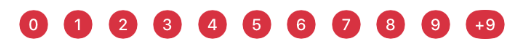

#  Badge

Badges are UI elements made up by a small red oval which may contain a white number. The number range goes from 1 to 9, for a number higher than 9 the text stays as "+9".  

## Usage

Create an instance of `BadgeView` with the style required.

```swift
let badgeView = BadgeView(style: .flag)
```

For use the same Badge in a tab bar

```swift
let item = createNovumTabBarItem(badgeValue: 9)
```

If the style selected is `Numeric`, you can use the `value` variable to specify the badge value.

## Styles

Badges come in two flavors. `Flag` and `Numeric`.

| `Flag`                                        |
|-----------------------------------------------|
|  |

| `Numeric`                                        |
|---------------------------------------------------|
|  |

| `Tab Bar Item`                                        |
|---------------------------------------------------|
|  |
