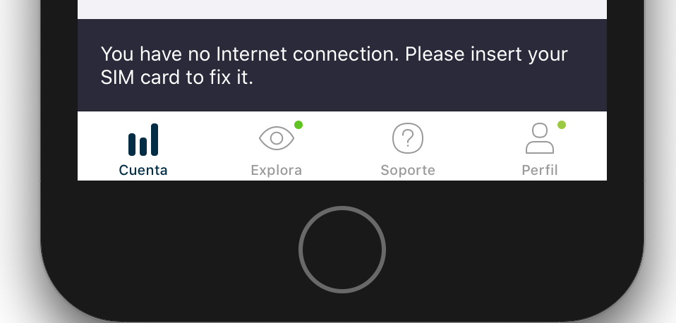
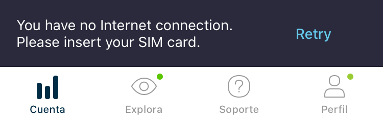
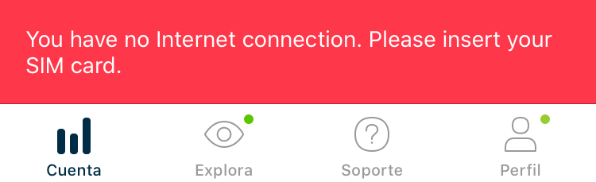
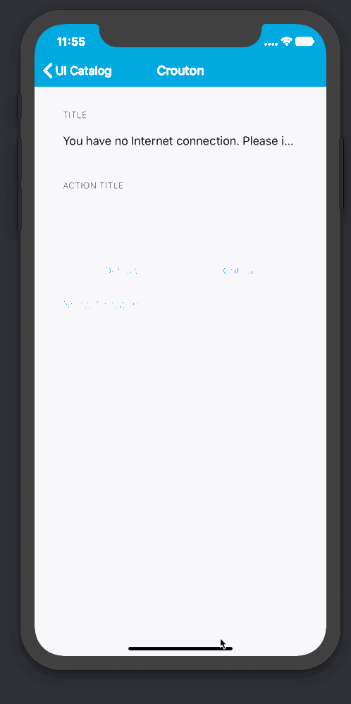

#  Crouton

Croutons provide lightweight feedback about an operation. They are the iOS equivalent of Android Snackbars. They show a brief message at the bottom of the screen. Croutons appear above all other elements on screen and only one can be displayed at a time.
Croutons can also contain an action.

## Usage

To display a crouton, use the `CroutonController` class, this class orchestrates Crouton presentation and allows dimissing already presented or enqueued croutons.

The `showCrouton` method will show (or enqueue if a crouton is already being shown) the crouton.

## Styles

Croutons come in two flavors. `Info` and `Critical`.

| `Info`                                        | `Critical`                                        |
|-----------------------------------------------|---------------------------------------------------|
|  |  |

## Dismissal / Cancellation

When presenting a crouton via the `showCrouton` method, you are given a `CroutonController.Token` type you can use to later `dismiss` the crouton if needed.

