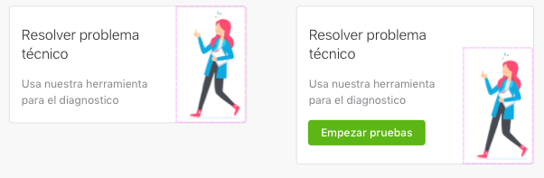

# HighlightedCard
HighlightedCard has two styles `inverse` and `normal`

|  Normal  |    Inverse    |
|----------|:-------------:|
|  |   |

Both styles share the same anatomy, described below from top to down.

* **Close Action**: optional.
* **Title**: non optional.
* **Subtitle**: non optional.
* **Action**: optional.
* **Background Image**: optional.
* **Right Image**: optional.

## Right Image
The right image can be displayed using two modes: `fit` and `fill`.
- `Fit` mode will scale the image to fit it in the current available space. The image will be aligned vertically to the bottom, and horizontally to the right. This mode is useful for images with transparent backgrounds or small assets.
- `Fill` mode will scale the image to fill the current available space. The image will be aligned vertically to the center, and horizontally to the right. This mode is useful for large images.

| Mode      |    Example    |
|------------|:--------------:|
| Fill          |   |
| Fit           |   |

## Usage

The **HighlightedCard()** is used as any other view. 

```swift
let highlightedCard = HighlightedCard()
highlightedCard.title = "Welcome"
highlightedCard.showCloseButton = true
```

When using with autolayout, **HighlightedCard** has no intrinsic size for the width but it has an specific intrinsic size for the height.
