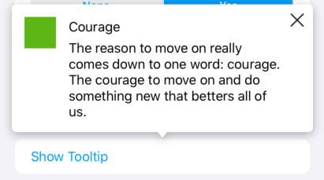

#  Popover

Popovers are UI elements made up by a box with some text and an arrow pointing to the element that the popover is being referred to.

Popovers can have a title, a message or both.

## Usage

Instantiate a `PopoverView`, and call the `show` method, passing in the view you want to use as an anchor.

You can set up close and tap actions (to dismiss the popover or to execute any additional logic). You can also set a `PopoverConfiguration` to override the default style of the popover.
