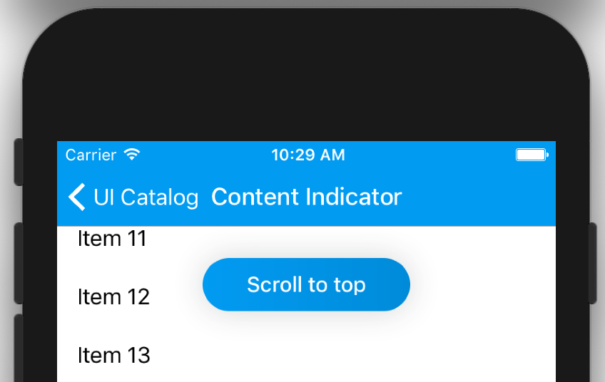
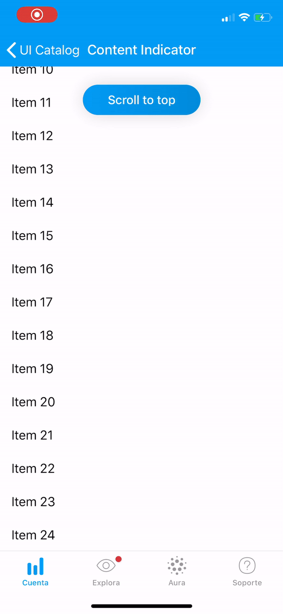

# ScrollContentIndicator

Scroll content indicator is a UI component intended to be used altogether with scrollable views in order to notify there is new content avaliable.

<p align="center">

</p>

# Usage

To display an indicator, use the `ScrollContentIndicator` class, this class orchestrates indicator presentation and allows dimissal but it's up to you when to present it and how to react to the tap event.

The `show` method will show the indicator and `hide` method will dismiss it.

Once you add it programatically or in a xib file you should `addTarget` or an `IBAction` to the button so you can receive the tap event to hide it and scroll to new content. 

# Example

```swift
private lazy var moreContentAvailableButton: ScrollContentIndicator = {
		let button = ScrollContentIndicator(title: "Scroll to top")
		button.addTarget(self, action: #selector(didTapIndicator), for: .touchUpInside)
		return button
	}()
```

