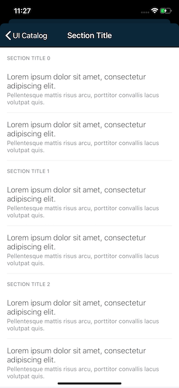

#  SectionTitle

`SectionTitle.swift` is used to separate sections within the same screen.



The title is always in uppercase.

## Usage

`SectionTitle.swift` inherit from `UITableViewHeaderFooterView` so you should configure  `SectionTitle.swift` in a `UITableView` like this

```swift
tableView.register(SectionTitle.self, forHeaderFooterViewReuseIdentifier: "SectionTitle")
```

`SectionTitle.swift` supports self sizing so the `UITableView` must be configured like

```swift
tableView.sectionHeaderHeight = UITableView.automaticDimension
tableView.estimatedSectionHeaderHeight = UITableView.automaticDimension
```
and finally return the `SectionTitle.swift` like

```swift
override func tableView(_ tableView: UITableView, viewForHeaderInSection section: Int) -> UIView? {
	let headerView = SectionTitleHeaderView.dequeueReusableHeaderFooterView(withIdentifier: "SectionTitle")

	headerView.title = "My Section Title"

	return headerView
}
```
