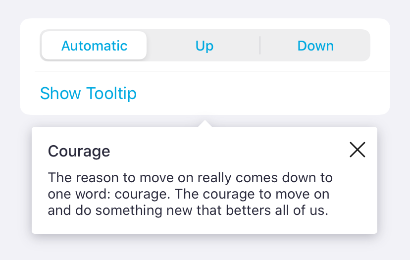

#  Tooltip

Tooltips (also called popovers by the Design Team), are UI elements made up by a box with some text and an arrow pointing to the element that the tooltip is being referred to.

Tooltips can have a title, a message or both.

## Usage

Instantiate a `TMFloatingTooltipView`, and call the `show` method, passing in the view you want to use as an anchor.

You can set up close and tap actions (to dismiss the tooltip or to execute any additional logic). You can also set a `TMFloatingTooltipViewConfiguration` to override the default style of the tooltip.