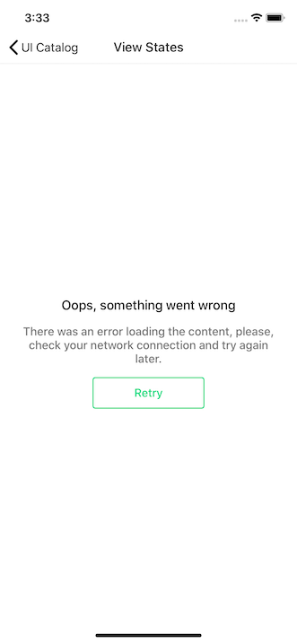

#  ViewStates

##  Load Error

The [Load Error component](https://app.zeplin.io/project/5d653c69f828bf7299c551c1/screen/5dc15cfd474d0e55ae1d5136) is made up by an optional title, a description, and a retry button.  
It can be shown when there's an error loading content.

###  Usage

The class implementing this component is `LoadErrorViewController`. Use [view controller containment](https://developer.apple.com/library/archive/featuredarticles/ViewControllerPGforiPhoneOS/ImplementingaContainerViewController.html) to embed it inside another.

The retry action is communicated via the `LoadErrorViewControllerDelegate.loadErrorViewControllerDidTapRetry(_:)` method. Make sure to set the `delegate` property of `LoadErrorViewController` to be notified of the retry action.

You can toggle the loading state of the button by calling `addActivityIndicatorToRetryButton()` and `removeActivityIndicatorFromRetryButton()`.

You can also be notified of `LoadErrorViewController` lifecycle events by setting the `lifecycleDelegate` property with an implementation of the `LoadErrorViewControllerLifecycleDelegate` protocol.
