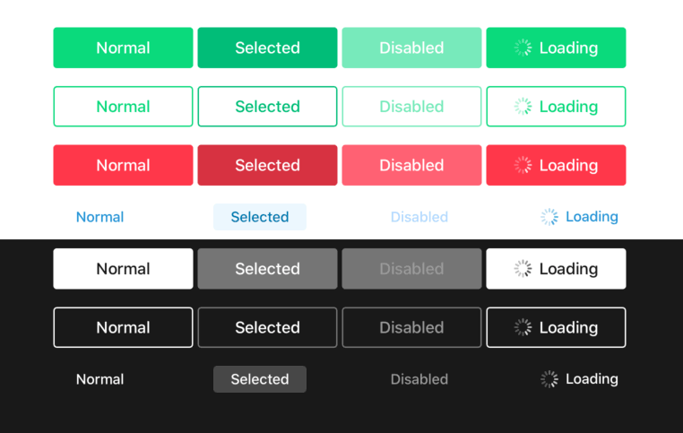
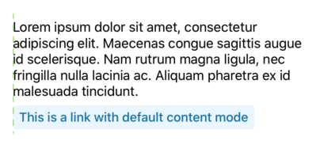
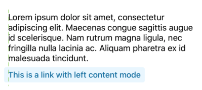

#  Button

The `Button.swift` class can render all Novum button styles with support for accessibility, loading states and more.

## Initialization

When using the buttons programmatically, use the constructor where you can specify the style, the size, and titles. You can also use them in Interface Builder, where you are able to change the `style`, `title`, ... properties after the button has been created.

You can check out the `ButtonStyle+Toolkit.swift` file to check out the available styles.

## State

Set a new value to the property `state` in order to change the button's state.

* **Normal:** Initial button state, enabled and accepting touches.
* **Selected:** It automatically changes to this state when the button is tapped and will remain like that until the tapped event stops.
* **Disabled:** In this state the button will not respond to touch events.
* **Loading:** Transitioning to (and from) this state will be animated, hiding the `title` and showing the `loadingTitle` (if any) and the activity indicator. While the button is in this state, it will not respond to touch events.

## Sizing
Buttons have an intrinsic content size that must be respected, so you shouldn't force a specific width or height. There could be cases where the width has to be specified, like when the button is in a flow where it has to cover the screen width, but usually the only thing you can do is to constraint it to the edges of the screen with greater than constraints so that the buttons never overflow (which could happen with long titles and dynamic type).

Button's width will be based on text size, using the longest text between `title` and `loadingTitle`. In case the text size doesn't reach a minimum, the button size will be based on a fixed minimum width.

## Alignment

In order to align the button the system will use the decorator view (button background) to locate the view edges. This can have unexpected consequences when aligning a button with another view:

In order to change this behavior, for `link` buttons, you can set the view's `contentMode` to `.left` or `.right` to enable bleed alignment for the title.
This means that the text will be left (or right) aligned and the "highlight" background will overflow the button.

