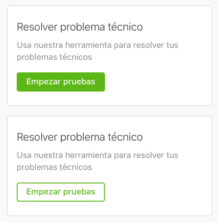
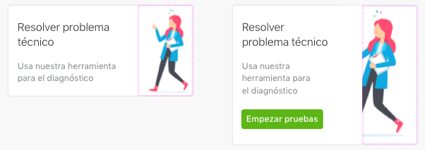
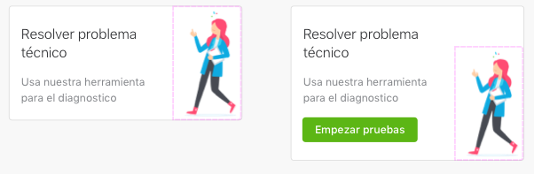

* [DataCard](#datacard)
   * [How to use a DataCard](#how-to-use-a-datacard)
   * [Adding extra content to a DataCard](#adding-extra-content-to-a-datacard)
* [MediaCard](#mediacard)
   * [How to use a MediaCard](#how-to-use-a-mediacard)
   * [Adding extra content to a MediaCard](#adding-extra-content-to-a-mediacard)
* [HighlightedCard](#highlightedcard)
   * [Right Image](#right-image)
   * [How to use a HighlightedCard](#how-to-use-a-highlightedcard)

## DataCard

DataCard is used to show relevant information (descriptions, data, statuses ...) of a user's product or service.


### How to use a DataCard

Create a `DataCardConfiguration` with the required parameters. For example, a basic configuration

```swift
DataCardConfiguration(title: "title", descriptionTitle: "a detail text")
```

Once the configuration is created, set the configuration to `dataConfiguration` property.

```swift
let myDataCard = DataCard()
myDataCard.dataConfiguration = myConfiguration
```

### Adding extra content to a DataCard

A DataCard can be customize adding an extra view like


The extra `UIView` can be provided to be placed below the `descriptionTitle` property. It will keep the same margins than the view above so no constraints should be required in order to properly align it with the rest of the content.

The view is added as child view of a `UIStackView` with a vertical `axis` and a leading `aligment` so the view will take the whole aviable width of the card.

Both cards have a property named `fragmentView`, which you should use for add the extra content.

## MediaCard

MediaCard is used to show offers, services and rich media.


### How to use a MediaCard

Create a `MediaCardConfiguration` with the required parameters. For example, a basic configuration

```swift
MediaCardConfiguration(richMedia: myRichMediaView, descriptionTitle: "a detail text")
```

Once the configuration is created, set the configuration to `dataConfiguration` property.

```swift
let myDataCard = MediaCard()
myDataCard.dataConfiguration = myConfiguration
```

### Adding extra content to a MediaCard

A MediaCard can be customize adding an extra view like


The extra `UIView` can be provided to be placed below the `descriptionTitle` property. It will keep the same margins than the view above so no constraints should be required in order to properly align it with the rest of the content.

The view is added as child view of a `UIStackView` with a vertical `axis` and a leading `aligment` so the view will take the whole aviable width of the card.

Both cards have a property named `fragmentView`, which you should use for add the extra content.

## HighlightedCard

HighlightedCard has two styles `inverse` and `normal`

|  Normal  |    Inverse    |
|----------|:-------------:|
|  |   |

Both styles share the same anatomy, described below from top to down.

* **Close Action**: optional.
* **Title**: non optional.
* **Subtitle**: non optional.
* **Action**: optional.
* **Background Image**: optional.
* **Right Image**: optional.

### Right Image
The right image can be displayed using two modes: `fit` and `fill`.
- `Fit` mode will scale the image to fit it in the current available space. The image will be aligned vertically to the bottom, and horizontally to the right. This mode is useful for images with transparent backgrounds or small assets.
- `Fill` mode will scale the image to fill the current available space. The image will be aligned vertically to the center, and horizontally to the right. This mode is useful for large images.

| Mode      |    Example    |
|------------|:--------------:|
| Fill          |   |
| Fit           |   |

### How to use a HighlightedCard

The **HighlightedCard()** is used as any other view. 

```swift
let highlightedCard = HighlightedCard()
highlightedCard.title = "Welcome"
highlightedCard.showCloseButton = true
```

When using with autolayout, **HighlightedCard** has no intrinsic size for the width but it has an specific intrinsic size for the height.
