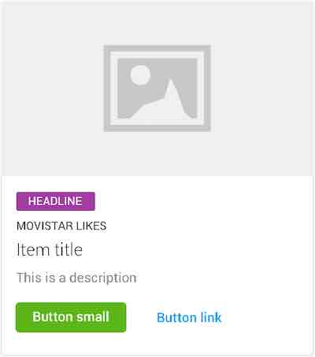
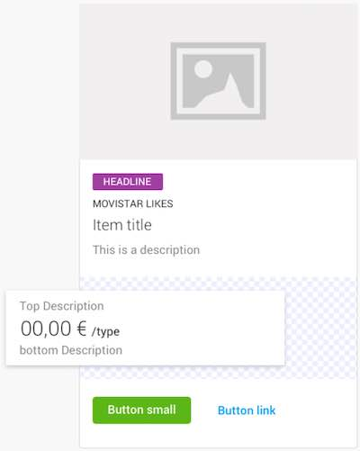

# DataCard

DataCard is used to show relevant information (descriptions, data, statuses ...) of a user's product or service.


## Usage

Create a `DataCardConfiguration` with the required parameters. For example, a basic configuration

```swift
DataCardConfiguration(title: "title", descriptionTitle: "a detail text")
```

Once the configuration is created, set the configuration to `dataConfiguration` property.

```swift
let myDataCard = DataCard()
myDataCard.dataConfiguration = myConfiguration
```

# MediaCard

MediaCard is used to show offers, services and rich media.



## Usage

Create a `MediaCardConfiguration` with the required parameters. For example, a basic configuration

```swift
MediaCardConfiguration(richMedia: myRichMediaView, descriptionTitle: "a detail text")
```

Once the configuration is created, set the configuration to `dataConfiguration` property.

```swift
let myDataCard = MediaCard()
myDataCard.dataConfiguration = myConfiguration
```

## Rich Media

MediaCard is used to show relevant information of sales, products, services and rich media.

# Extra Content

Both card style can be customize adding an extra view like



The extra `UIView` can be provided to be placed below the `descriptionTitle` property. It will keep the same margins than the view above so no constraints should be required in order to properly align it with the rest of the content.

The view is added as child view of a `UIStackView` with a vertical `axis` and a leading `aligment` so the view will take the whole aviable width of the card.

Both cards have a property named `fragmentView`, which you should use for add the extra content.
