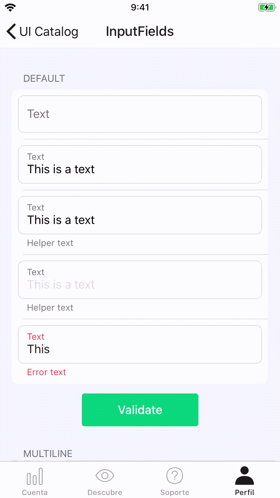
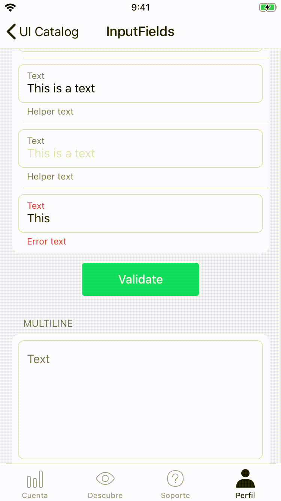

#  InputField

The `InputField.swift` class can render all Novum input field styles with support for accessibility, editing states and more.

## Initialization

When using the buttons programmatically, use the constructor where you can specify the style, the size, and titles. You can also use them in Interface Builder, where you can change the `style`, `title`, ... properties after the input field have been created.

You can check out the `InputFieldStyle+Toolkit.swift` file to check out the available styles.

## State

Set a new value to the property `state` to change the input field state.

* **Normal:** Initial input field state, enabled and accepting touches. Transitioning to (and from) this state will be animated. 
* **Disabled:** Transitioning to this state will be non-animated. While the input field is in this state, it will not respond to touch events.
* **Invalid:** Shows the invalid style with an assistive text. Transitioning to (and from) this state will be animated.


When editing, the placeholder will be animated to a colored text. The `textColor` is a non-animatable property, so a new label above the placeholder with the final textColor. To get the transition effects, the alpha is changed to make a fade in the color.

When editing when there is any value in the input, the placeholder will be placed on top of the input. The font is a non-animatable property, so scaling and translating transform are applied to the label to fit it the correct position.



## Sizing
Input fields have an intrinsic content size that must be respected, so you shouldn't force a specific height. There could be cases where the width has to be specified, but usually, the only thing you must do is to constrain it to the edges of the screen.
 
 Note that the input can grow or shrink on height when changing the `assistiveText`. For those cases, a delegate method will be called so you can layout your screen (`inputFieldShouldLayout(field:)`. For example, if your input is inside a cell of a tableView with automatic dimension enabled, you can call `beginUpdates` and `endUpdates` so the table can recalculate the sizes of cells.
 
```swift
func inputFieldShouldLayout(_ field: InputField) {
    tableView.beginUpdates()
    tableView.endUpdates()
}
```
 
 
 
## Validation

Local validation based on content is supported. To enable validation just set a `InputFieldValidationStrategy` to the `InputField`.
`InputField` will update is stated based on the text whenever `validate()` method is called. To check the validation state without updating the 
`InputField` state, the `isValid` property can be used.

```swift
let inputField = InputField(style: .email)
inputField.placeholderText = "Email"
inputField.validationStrategy = EmailInputFieldValidationStrategy()
inputField.text = "jmp"
inputField.validate() // sets the state to .invalid
inputField.isValid // returns false
```

To create a new validation strategy just implement the  `InputFieldValidationStrategy` protocol.

