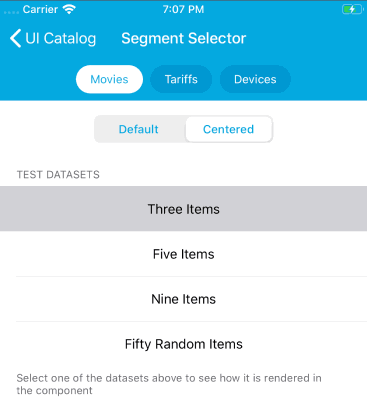
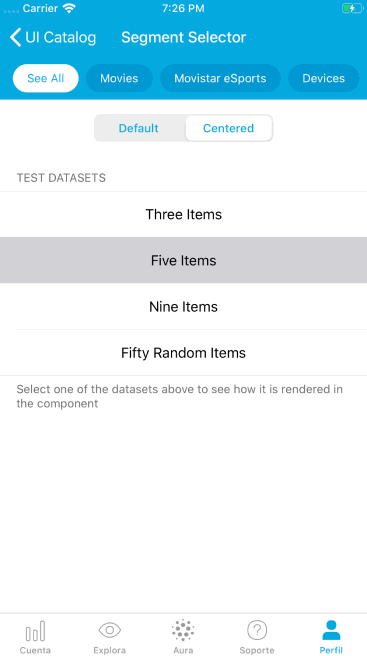

#  SegmentSelector

`SegmentSelector` is used to render a scrollable selector that will typically be placed below the navigation bar, and which is used to let the user select one segment among a list of them. You will typically use the selected segment to filter or categorize the content below.


The most similar component to use as a reference is [Material's Choice Chips](https://material.io/components/chips/#choice-chips)


## Features

When the user selects a segment which is only partially visible, the component will scroll to show the selected segment and a small piece of the next one.

Also, there are two modes of displaying the segments:

* `default`: Segments are always aligned to the left of the screen.

* `center`: When the bounds of the component are bigger than the `contentSize` plus the separators and insets, segments will be rendered in the center of the component.




## Accessibility

Given that this component is designed to be placed below a navigation bar (or in substitution of the NavBar), the component opts out of Dynamic Type, and makes use of Large Content Viewer. This means that when the user selects an accessibility text size, the user can long press in the `SegmentSelector` to show a HUD with the name of the categories, similarly to what happens in native toolbars.



This feature is available only on iOS 13, so unfortunately, previous versions won't have accessibility support for large content.

Finally, the component is optimized for VoiceOver.


## Usage

Create an instance of `SegmentSelector` by providing a list of `Segment`'s to be displayed, and optionally a `SegmentsContentMode`.

```swift
let segments = [
	Segment(id: "0", title: "segment 0"),
	Segment(id: "1", title: "segment 1")
]
let segmentsSelector = SegmentSelector(segments: segments, 
                                       scrollableContentMode: .center)
```

You can reset the `segments` and `scrollableContentMode` at your discretion. Every time you set either of these properties, the segments will automatically reload.

Set a delegate for the component if you want to be notified when a segment is selected, or use the `selectedSegment` property to retrieve the selected segment at any moment. Also, you can call `select(_)` to programmatically select a particular segment.


### Interface Builder

You can also embed  `SegmentSelector` in a xib. Just put a plain UIView in your canvas and then in the Identity Editor tab, set  `SegmentSelector` as the class name. Then you can create an outlet and add segments in `viewDidLoad()` or wherever fits better your problem.

```swift
class ViewController: UIViewController {

	@IBOutlet var segmentSelector: SegmentSelector!

	override func viewDidLoad() {
		super.viewDidLoad()
		segmentSelector.segments = [
			Segment(id: "0", title: "TV"),
			Segment(id: "1", title: "Sports")
		]
	}
}
```


## Sizing

`SegmentSelector` has a **fixed height** of 48 points. So keep this in mind when laying out this component.
