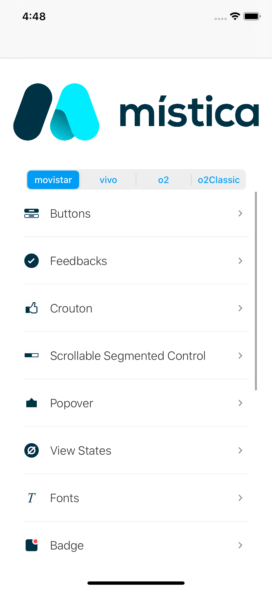

<br>
<br>

<br>

#  Mistica for iOS

[](https://github.com/Telefonica/mistica-ios)
[](https://github.com/Telefonica/mistica-ios)
[](https://github.com/Telefonica/mistica-ios)
[](https://github.com/Carthage/Carthage)
[](https://cocoapods.org/)

Mistica is a framework that contains reusable UI components and utilities.

## Instalation

### Carthage

Add Mistica to your `Cartfile`:

```
github "Telefonica/mistica-ios" "master"
```

And then run:

```
carthage update --platform iOS --use-ssh
```

> More information about Carthage integration [here](https://github.com/Carthage/Carthage#if-youre-building-for-ios-tvos-or-watchos)

### Cocoapods

Add Mistica to your `Podfile`:

```
pod 'Mistica', :git => 'git@github.com:Telefonica/mistica-ios.git'
```

And then run:

```
pod install
```

### Swift Package Manager

Support for SPM will be considered after the release of Xcode 12 and the new support of swift packages with resources.

## Configuration

By default the framework components are created with the Movistar's brand style and the `standard` theme variant, to select a different one, configure the brand style and/or variant:

```swift
Mistica.brandStyle = .o2
Mistica.themeVariant = .prominent
```

Remember to initialize Mistica with you desired brand style before the initialize the UI of your app.

In applications before iOS 13, the initialziation should be done in **UIApplicationDelegate**,

```swift
func application(_: UIApplication, didFinishLaunchingWithOptions _: [UIApplication.LaunchOptionsKey: Any]?) -> Bool {
    // Set up Mistica
    Mistica.brandStyle = .vivo
    
    return true
}
```

For applications in iOS 13 and above, the initialization should be done in **SceneDelegate**

```swift
func scene(_ scene: UIScene, willConnectTo _: UISceneSession, options _: UIScene.ConnectionOptions) {
    guard let windowScene = (scene as? UIWindowScene) else { return }

    // Configure brand style before initializing the UI
    Mistica.brandStyle = .movistar
}
```

## Components

* [Button](./Mistica/Components/Button/)
* [Crouton](./Mistica/Components/Crouton/)
* [SegmentSelector](./Mistica/Components/SegmentSelector/)
* [Feedbacks](./Mistica/Components/Feedback/)
* [Popover](./Mistica/Components/Popover/)
* [ViewStates](./Mistica/Components/ViewStates/)
* [Badge](./Mistica/Components/Badge/)
* [InputFields](./Mistica/Components/InputField/)
* [ScrollContentIndicator](./Mistica/Components/ScrollContentIndicator/)
* [Lists](./Mistica/Components/Lists/)
* [SectionTitle](./Mistica/Components/SectionTitle/)
* [Header](./Mistica/Components/Header/)


## Components Catalog

In `MisticaCatalog.framework` you can find a catalog with all the components of Mistica. In this catalog you can see the components in action.

<div align="center">

</div>

The instalation process is the same than for `Mistica.framework`.

And for showing the catalog you only need to show **UICatalogViewController**.

## Contributing

See [CONTRIBUTING.md](./CONTRIBUTING.md)
