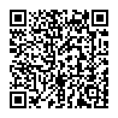

<br>

[](https://github.com/Telefonica/mistica-ios)
[](https://github.com/Telefonica/mistica-ios)
[](https://github.com/Telefonica/mistica-ios)
[](https://github.com/apple/swift-package-manager)
[](https://github.com/Carthage/Carthage)
[](https://cocoapods.org/)

Mistica is a framework that contains reusable UI components and utilities for the Telefonica Design System ([Mistica](https://github.com/Telefonica/mistica))

- [Installation](#installation)
  - [Swift Package Manager](#swift-package-manager)
  - [Carthage](#carthage)
  - [Cocoapods](#cocoapods)
- [Configuration](#configuration)
- [Fonts](#fonts)
- [Components](#components)
- [Demo app](#demo-app)
- [Contributing](#contributing)

## Packages

This repo has contains three different packages:

- `Mistica`: It contains all the components of Mistica for `UIKit`.
- `MisticaSwiftUI`: It contains all the components of Mistica for `SwiftUI`.
- `MisticaCommon`: It contains all the common elements for both UIKit and SwiftUI implementation, including assets, colors and fonts. It is internal, so you won't need to import it in any case.

## Installation

### Swift Package Manager

You can add Mistica to an Xcode project by adding it as a package dependency.

1. From the **File** menu, select **Swift Package** > **Add Package Dependency**.
2. Enter "[https://github.com/Telefonica/mistica-ios](https://github.com/Telefonica/mistica-ios)" into the package repository URL text field.
3. From the **Add Package to App** window, select **MisticaCommon** and **Mistica** or **MisticaSwiftUI** library.

You also can integrate Mitica to Swift Package, add the following as a dependency to your `Package.swift`:

```swift
.package(name: "Mistica", url: "https://github.com/Telefonica/mistica-ios.git", .from("2.0.0"))
```

and then specify `"Mistica"` or `"MisticaSwiftUI"` as dependencies of the target in which you wish to use Mistica.

### Carthage

Add Mistica to your `Cartfile`:

```
github "Telefonica/mistica-ios"
```

And then run:

```
carthage update --platform iOS --use-ssh --use-xcframeworks
```

> More information about Carthage integration [here](https://github.com/Carthage/Carthage#if-youre-building-for-ios-tvos-or-watchos)

### Cocoapods

Add Mistica to your `Podfile`:

```
pod 'MisticaSwiftUI', :git => 'git@github.com:Telefonica/mistica-ios.git'
```
or 
```
pod 'Mistica', :git => 'git@github.com:Telefonica/mistica-ios.git'
```

And then run:

```
pod install
```

## Configuration

By default the framework components are created with the Movistar's brand style and the `standard` theme variant, to select a different one, configure the brand style and/or variant:

```swift
MisticaConfig.brandStyle = .o2
MisticaConfig.themeVariant = .prominent
```

Remember to initialize Mistica with you desired brand style before the initialize the UI of your app.

In applications before iOS 13, the initialziation should be done in the **UIApplicationDelegate**,

```swift
func application(_: UIApplication, didFinishLaunchingWithOptions _: [UIApplication.LaunchOptionsKey: Any]?) -> Bool {
    // Set up Mistica
    MisticaConfig.brandStyle = .vivo

    return true
}
```

For applications in iOS 13 and above, the initialization should be done in the **SceneDelegate**

```swift
func scene(_ scene: UIScene, willConnectTo _: UISceneSession, options _: UIScene.ConnectionOptions) {
    guard let windowScene = (scene as? UIWindowScene) else { return }

    // Configure brand style before initializing the UI
    MisticaConfig.brandStyle = .movistar
}
```

Every component in mistica supports dark mode. In order to configure dark mode in you app, you can follow [Apple guidelines](https://developer.apple.com/documentation/xcode/supporting_dark_mode_in_your_interface/choosing_a_specific_interface_style_for_your_ios_app).

## Fonts

By default mistica uses the system font, but if you need to use a custom font (Telefonica font, On-Air, etc) you can follow [these instructions](./Sources/Mistica/Fonts/).

## Components

### UIKit 
* [Badge](./Sources/Mistica/Components/Badge/)
* [Button](./Sources/Mistica/Components/Button/)
* [Cards](./Sources/Mistica/Components/Cards/)
	* [DataCard](./Sources/Mistica/Components/Cards/#datacard)
	* [MediaCard](./Sources/Mistica/Components/Cards/#mediacard)
	* [HighlightedCard](./Sources/Mistica/Components/Cards/#highlightedcard)
* [Checkbox](./Sources/Mistica/Components/Checkbox/)
* [Controls](./Sources/Mistica/Components/Controls/)
* [Crouton](./Sources/Mistica/Components/Crouton/)
* [EmptyState](./Sources/Mistica/Components/EmptyState/)
* [Feedbacks](./Sources/Mistica/Components/Feedback/)
* [Filter](./Sources/Mistica/Components/Filter/)
* [Form](./Sources/Mistica/Components/Form/)
* [Header](./Sources/Mistica/Components/Header/)
* [InputFields](./Sources/Mistica/Components/InputField/)
* [Lists](./Sources/Mistica/Components/Lists/)
* [NavigationBar](./Sources/Mistica/Components/NavigationBar/)
* [Popover](./Sources/Mistica/Components/Popover/)
* [RadioButton](./Sources/Mistica/Components/RadioButton/)
* [ScrollContentIndicator](./Sources/Mistica/Components/ScrollContentIndicator/)
* [SectionTitle](./Sources/Mistica/Components/SectionTitle/)
* [Stepper](./Sources/Mistica/Components/Stepper/)
* [Switch](./Sources/Mistica/Components/Switch/)
* [Tabs](./Sources/Mistica/Components/Tabs)
* [Tag](./Sources/Mistica/Components/Tag/)
* [ViewStates](./Sources/Mistica/Components/ViewStates/)

### SwiftUI
* [Badge](./Sources/MisticaSwiftUI/Components/Badge/)
* [Button](./Sources/MisticaSwiftUI/Components/Button/)
* [Cards](./Sources/MisticaSwiftUI/Components/Cards/)
    * [DataCard](./Sources/MisticaSwiftUI/Components/Cards/#datacard)
    * [Not Implemented][MediaCard](./Sources/MisticaSwiftUI/Components/Cards/#mediacard)
    * [Not Implemented][HighlightedCard](./Sources/MisticaSwiftUI/Components/Cards/#highlightedcard)
* [Checkbox](./Sources/MisticaSwiftUI/Components/Checkbox/)
* [Crouton](./Sources/MisticaSwiftUI/Components/Snackbar/)
* [EmptyState](./Sources/MisticaSwiftUI/Components/EmptyState/)
* [Feedbacks](./Sources/MisticaSwiftUI/Components/Feedback/)
* [Not Implemented][Filter](./Sources/MisticaSwiftUI/Components/Filter/)
* [Not Implemented][Header](./Sources/MisticaSwiftUI/Components/Header/)
* [InputFields](./Sources/MisticaSwiftUI/Components/InputField/)
* [Lists](./Sources/MisticaSwiftUI/Components/Lists/)
* [Popover](./Sources/Mistica/Components/Popover/)
* [RadioButton](./Sources/MisticaSwiftUI/Components/RadioButton/)
* [ScrollContentIndicator](./Sources/Mistica/Components/ScrollContentIndicator/)
* [SectionTitle](./Sources/MisticaSwiftUI/Components/SectionTitle/)
* [Stepper](./Sources/MisticaSwiftUI/Components/Stepper/)
* [Tabs](./Sources/MisticaSwiftUI/Components/Tabs)
* [Tag](./Sources/MisticaSwiftUI/Components/Tag/)
* [Not Implemented][ViewStates](./Sources/MisticaSwiftUI/Components/ViewStates/)

## Demo app
Included in this repository there's a demo app showcasing all implemented components. With each new release, a new version of the mistica catalog app is created. It can be installed with this [link](https://install.appcenter.ms/orgs/tuenti-organization/apps/mistica-ios/distribution_groups/public) or by using the following QR:

<p align="center">

</p>

## Contributing

See [CONTRIBUTING.md](./CONTRIBUTING.md)
