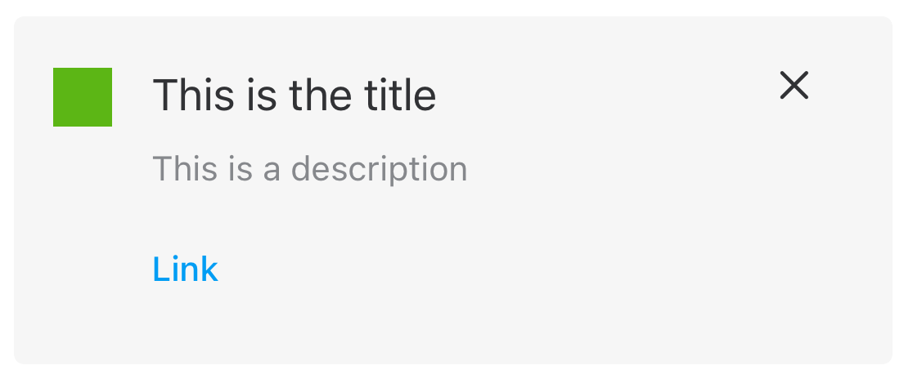

#  Callouts

Callouts are UI elements made up by a box with some text, icon and actions.

All the elements are optional except the description item that is mandatory.



## How to use a Callout

Create a `CalloutConfiguration` with the required parameters. For example, a basic configuration

```swift
let configuration = CalloutConfiguration(asset: CalloutConfiguration.CalloutAssetType.none,
                                        title: nil,
                                        description: "This is a description",
                                        actions: nil,
                                        canClose: false)
```

Once the configuration is created, set the configuration to `contentConfiguration` property.

```swift
let myCallout = Callout()
myCallout.contentConfiguration = configuration
```
