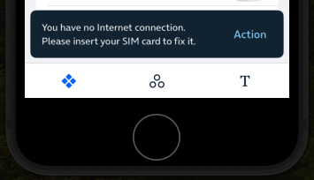
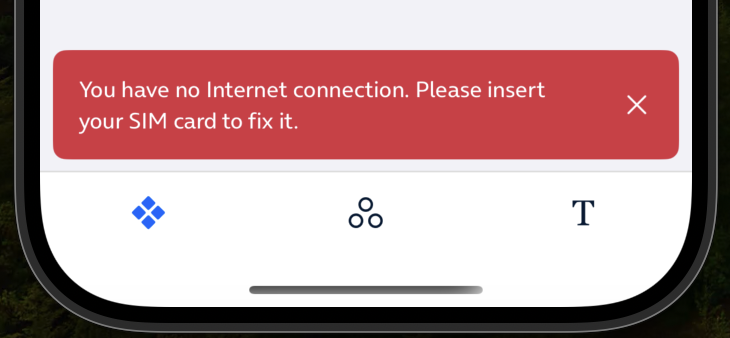
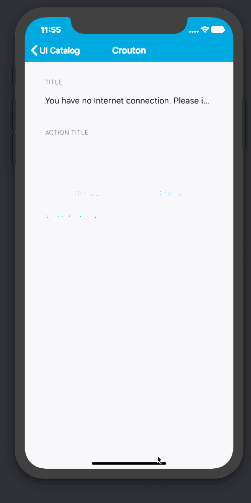

#  Snackbar

Snackbar provide lightweight feedback about an operation. They show a brief message at the bottom of the screen. It is positioned floating at the bottom of the screen respecting the safe area and, if there is a tab bar, it appears above it. Snackbar appear above all other elements on screen and only one can be displayed at a time.
Snackbar can also contain an action.

## Usage

To display a snackbar, use the `SnackbarController` class, this class orchestrates Snackbar presentation and allows dimissing already presented or enqueued snackbar.

The `showSnackbar` method will show (or enqueue if a snackbar is already being shown) the snackbar.

## Styles

Snackbar come in two flavors. `Info` and `Critical`.

| `Info`                                        | `Critical`                                        |
|-----------------------------------------------|---------------------------------------------------|
|  |  |

## Dismissal / Cancellation

When presenting a snackbar via the `showSnackbar` method, you are given a `SnackbarController.Token` type you can use to later `dismiss` the snackbar if needed.

## Config

When configuring the Snackbar you can select different intervals with some features:

| `Interval` |   `Close`  |  `Action`  |
|------------|------------|------------|
|     5"     |     NO     |     NO     |
|     10"    |     NO     |  Mandatory |
|  Infinite  |  Mandatory |     NO     |
|  Infinite  |  Optional  |    YES     |
