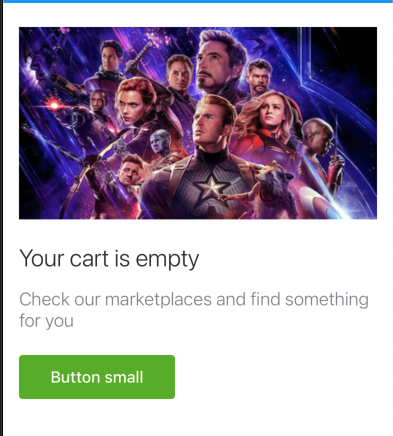

#  Empty State

Empty State is an UI element made up by an Asset as an icon, small image or fullwidth with some text and actions.

It could be represented as a card or just a view.

All the elements are optional except the Asset and the title that are mandatory.



## How to use an Empty State

Create a `EmptyStateConfiguration` with the required parameters. For example, a basic configuration

```swift
let configuration = EmptyStateConfiguration(asset: EmptyStateConfiguration.EmptyStateAssetType.fullWidthImage(image),
                                            title: "This is the title",
                                            description: "This is the description",
                                            actions: mptyStateConfiguration.EmptyStateActions.primary(EmptyStateButton(title: "Button small", loadingTitle: nil, tapHandler: nil)),
                                            isCard: false)
```

Once the configuration is created, set the configuration to `contentConfiguration` property.

```swift
let myEmptyState = EmptyState()
myEmptyState.contentConfiguration = configuration
```
