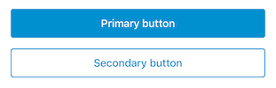

#  Feedback

The Feedback view will be in charge of rendering different types of feedbacks. Its content is customisable while the appearance is automatically configured per brand based on the selected feedback style. Background color, icon, animations, fonts and colors are predefined and can't be changed.


## Configurable options

### Title and Subtitle

Multiline strings that will be positioned one below the other. If the content is large enough the view will scroll.

### Style

There are three fixed styles available: `.success`, `.informative`, `.error`. There's one custom style `.feedback(image)` that can be used to provide an icon that will be used instead of the fixed ones:

| Success     | Informative     | Error     |
|-------------|-----------------|-----------|
|  |  |  |

All styles, if presented modally, will show a 'close' button. If they are presented with a push, a back button will show up except when the style is `success`. In that case the actions should dismiss this screen.

### Primary Action

For the primary action, there are three different options: 

- **Button:** `FeedbackPrimaryAction.button(title: "Primary button", completion: { ... })`
- **Retry Button:** `FeedbackPrimaryAction.retryButton(title: "Primary button", loadingTitle: nil, retryCompletion: { completionHanlder in ... })`
- **No button:** `FeedbackPrimaryAction.none`

| Button    | Retry Button     |
|-------------|-----------------|
|  |   |

⚠️ For the **Retry Button** is important execute the `completionHandler` closure when the async retry task is finished.
```swift
retryCompletion: { completionHandler in
    // Do async retry task
    DispatchQueue.main.async {
        completionHandler()
    }
}
```

### Secondary Action

For the secondary action, there are three different options: 

- **Button:** `FeedbackSecondaryAction.button(title: "Secondary button", completion: { ... })`
- **Link:** `FeedbackSecondaryAction.link(title: "Secondary button", completion: { ... })`
- **No button:** `FeedbackSecondaryAction.none`

| Button    | Link     | None |
|-------------|-----------------|-----------|
|  |   |  |

### Extra Content

An extra `UIView` can be provided to be placed below the subtitle. It will keep the same margins than the view above so no constraints should be required in order to properly align it with the rest of the content.

## Usage

Import `CommonUIKit` and create a `FeedbackConfiguration` with the required parameters. For example, a configuration for a success feedback with a link secondary action and an extra view:

```swift
FeedbackConfiguration(style: .success,
                      title: "Title",
                      subtitle: "Subtitle",
                      primaryAction: .button(title: "Primary Action", completion:{ ... }),
                      secondaryAction: .link(title: "Secondary Action", completion:{ ... }),
                      extraContent: CustomExtraUIView())
```

The configuration can be simplified if only the required parameters are provided, by default there's no secondary action and extra content view:

```swift
FeedbackConfiguration(style: .success,
                      title: "Title",
                      subtitle: "Subtitle",
                      primaryAction: .button(title: "Primary Action", completion:{ ... }))
```

Once the configuration is created, use the `feedbackNavigator` available in the `CommonUIKitAssembly` to `push` or `present` the feedback view:

```swift
feedbackNavigator.pushFeedback(configuration: configuration)
```

```swift
feedbackNavigator.presentFeedback(configuration: configuration)
```


