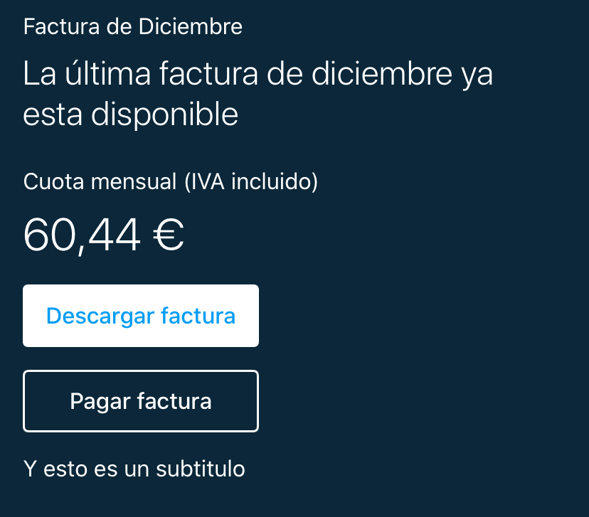
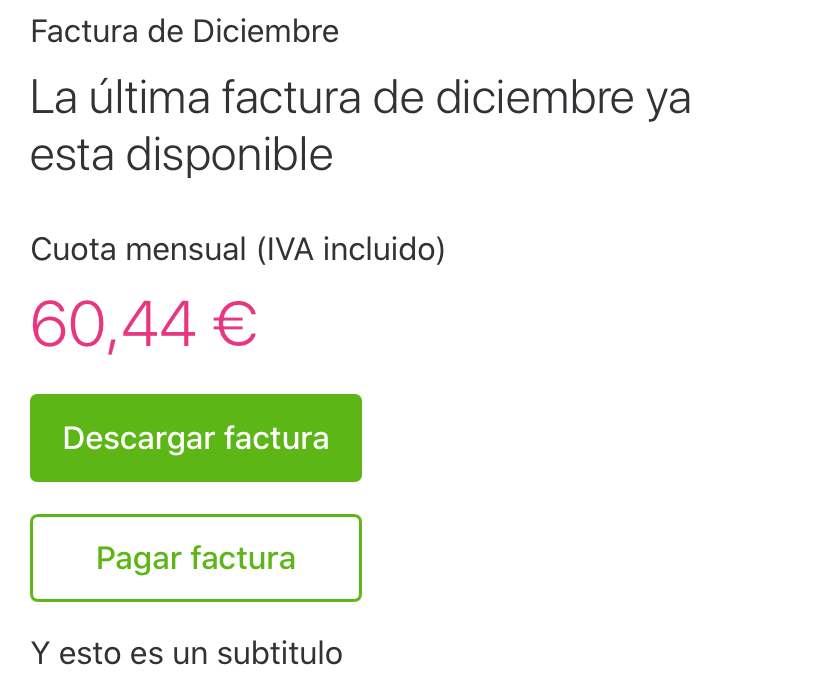

# Header
Headers has two styles `inverse` and `normal`

| Inverse   |      Normal      |
|----------|:-------------:|
|  |   |

Both styles share the same anatomy, described below from top to down

* **Pretitle**: optional
* **Title**: non optional
* **Preamount**: optional
* **Amount**: configuirable in two styles normal and danger, optional
* **Pimary Action**: optional.
* **Secondary Action**: optional.
* **Subtitle**: optional

**Pretitle**, **Preamount** and **Subtitle** have two text colors styles: primary and secondary.

## Usage

The **HeaderView** is used as any other view. 

```swift
let headerView = HeaderView()
```

When using with autolayout, **HeaderView** has no intrinsic size for the width but it has an specific intrinsic size for the height.

When the **HeaderView** is below the navigation bar, you can remove the top marging space.

```swift
let headerView = HeaderView()
headerView.usingInLargeNavigationBar = true
```

