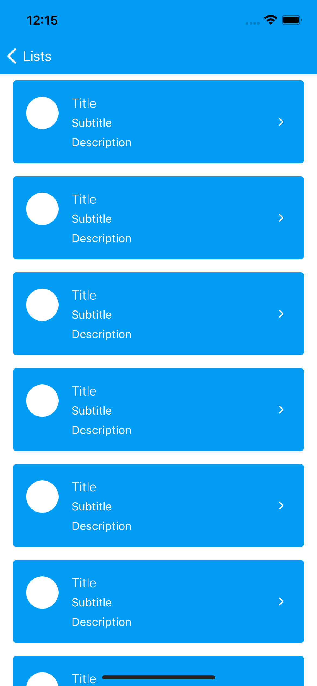

#  Lists

Lists are continous group of text with images and/or controls. We currently provide two classes `ListTableView.swift` and `ListTableViewCell.swift`.

Lists has two styles of cells `FullWidth`, `Boxed` and `BoxedInverse`

| FullWidth   |      Boxed      | Boxed Inverse |
|----------|:-------------:|:-------------:|
|  |   |   |


#  ListCellContentView

`ListContentViewCell` has the following anatomy

<p align="center">
  
</p>

* **Section A** contains an asset, which can be configured with one of the following three styles:
	- **Small icon**: 24x24 icon.
	- **Large icon**: 24x24 icon centered on a circle with 40px diameter and a provided background color.
	- **Image**: an image cliped to a circle with 40px diameter.
* **Section B** contains the following elements (described form top to down)
	* A headline section which can be customized with any kind of `UIView`
	* Title: non optional
	* Subtitle: optional
	* Description: optional
* **Section C** can be configured with any kind of UIView.

## Usage

`ListTableView` inherit from `UITableView` so you should configure `ListTableView` as you usually configure a `UITableView`.

```swift
let listTableView = ListTableView()
listTableView.delegate = // set you delegate
listTableView.dataSource = // set you datasource
```

Then register the `ListTableViewCell.swift` on you recently created `ListTableView`

```swift
listTableView.register(ListTableViewCell.self, forCellReuseIdentifier: "ListTableViewCell")
```

### Configuring ListTableViewCell

You can use `ListTableViewCell.swift` component directly or inherit from him, a full configuration looks like

```swift
public func tableView(_ tableView: UITableView, cellForRowAt indexPath: IndexPath) -> UITableViewCell {
	let cell = listTableView.dequeueReusableCell(withIdentifier: "ListTableViewCell", for: indexPath) as! ListTableViewCell

	cell.listCellContentView.title = "My title"
	cell.listContentViewCell.detailText = "My detail text"
	cell.listContentViewCell.assetType = .largeIcon(UIImage(named: "myAsset"), backgroundColor: .iconDisabled)
	cell.isCellSeparatorHidden = isLastCell(indexPath)

	return cell
}
```

#### Control Customization

`ListTableViewCell.swift` can be configured with a custom control like

```swift
public func tableView(_ tableView: UITableView, cellForRowAt indexPath: IndexPath) -> UITableViewCell {
	let cell = listTableView.dequeueReusableCell(withIdentifier: "ListTableViewCell", for: indexPath) as! ListTableViewCell

	...

	cell.listContentViewCell.controlView = myCustomControlView

	...

	return cell
}
```

The view asigned to `controlView` is added in a horizontal `UIStackView` with a fill distribution and the custom view is aligned to the top. The view will be stretched filling the available height space determined by the elements in the **Section B**.

We provide two presets custom controls.

* **VerticallyCenteredPresetView**, aligns the center of an arranged view with its center of the cell view.
* **NavigationPresetView**, a custom preset control for rows that navigate and need a badge view.

