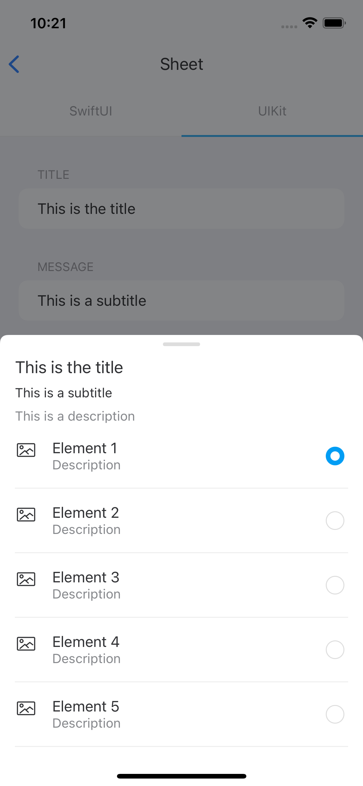

#  Sheet

Sheet provide lightweight bottom selector view. It is possible to display different types of content, although currently support is made for a single selection list. Each row of the list can be composed of an icon, text and a radioButton to select the option.

## Usage

To display a sheet, make an instance of `SheetViewController` class, the controller has a `SheetView` that is self-managing in its presentation. It is also necessary to instantiate and assign as transition delegate to the `SheetTransitioningDelegate` class.

## Dismiss / Submit

The presentation of the Sheet is currently disabled by selecting an option in the list or by performing any gesture outside the sheet or a drag down gesture on the component itself. 

In all cases a handler of the response selected by default or by the user is performed right now.

