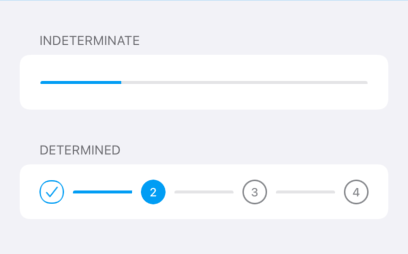

# Steppers

There are two types of steppers: Indeterminate and determined steppers.



## Indeterminate

Use `IndeterminateStepperView` inside any view. The progress of this stepper has a range of steps from 0 to 100.
The progress can be set using the `value` property or the `setValue` method: if the value passed is lower than 0 then 0 will be set;
on the other hand, if a value greater than 100 is passed then 100 will be set.

```swift
let stepper = IndeterminateStepperView()
stepper.value = 50
```

## Determined

Use `DeterminateStepperView` inside any view.

The number of steps and the current step can be set using `numberOfSteps` and `currentStep` or  `setCurrentStep` methods respectively.

Determinate steppers has a maximum number of visible steps, if the number of steps is more that five,
then an indeterminate stepper should be used.

```swift
let stepper = DeterminateStepperView()
stepper.numberOfSteps = 3
stepper.currentStep = 0
```
