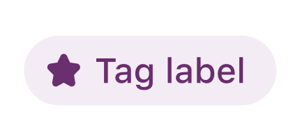
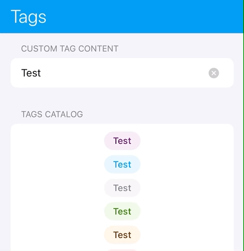
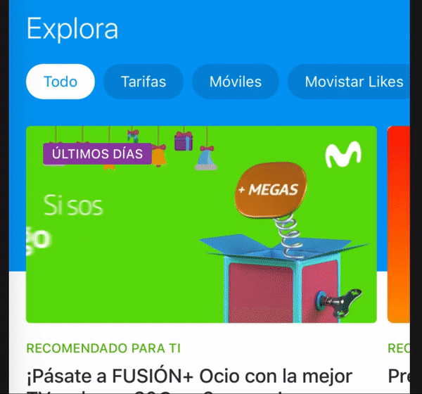

# Tag

This view consists of a label to display text with a defined style. It is also known as _Promotional Tag_.

## Properties

### Style

You can choose between following styles: promo, active, inactive, success, warning, error, inverse.

### Text

Content which will be presented as capitalized with center text alignment.

### Icon

An icon can be added to the tag component.

## Intrinsic content size

This view can resolve its size (`intrinsicContentSize`) depending on its child elements so a specific width/height is not required. Basically it will depend on the `text`, which has a minimum width for small content. It will crop the content when the `text` is longer for one line label. Icon will be resized and tinted with color of defined style.

## Accessibility

The `Tag` is responsive to dynamic type changes so its internal label will increase/decrease the whole component when that value changes.

