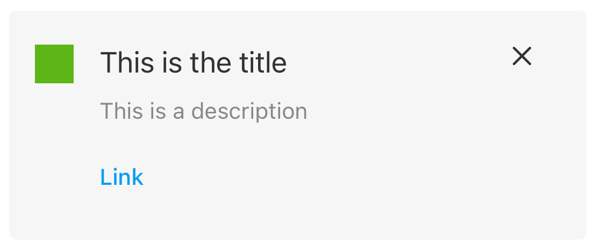

#  Callouts

Callouts are UI elements made up by a box with some text, icon and actions.

All the elements are optional except the description item that is mandatory.



## How to use a Callout

Create a `Callout` with the required parameters. For example, a basic configuration

```swift
Callout(
    assetType: .none,
    title: "Hola",
    description: "Description",
    primaryButton: { Button("Primary") {} },
    linkButton: { Button("Link") {} }
)
```
