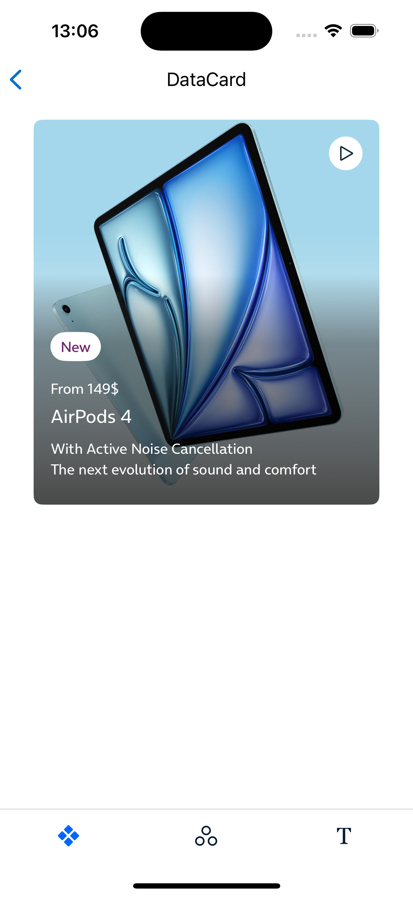

# Cards

* [DataCard](#datacard)
   * [How to use a DataCard](#how-to-use-a-datacard)
   * [Adding extra content to a DataCard](#adding-extra-content-to-a-datacard)

* [PosterCard](#postercard)
   * [How to use a PosterCard](#how-to-use-a-postercard)
   * [Adding extra content to a PosterCard](#adding-extra-content-to-a-postercard)

* [SnapCard](#snapcard)
   * [How to use a SnapCard](#how-to-use-a-snapcard)

* [Accessibility](#accessibility)

## DataCard

DataCard is used to show relevant information (descriptions, data, statuses ...) of a user's product or service.


### How to use a DataCard

Just use on the default initialisers depending on your needs. For example, a basic configuration:

```swift
 DataCard(
     headline: headline,
     title: title,
     subtitle: subtitle,
     description: description
)
```

### Adding extra content to a DataCard

A DataCard can be customized adding an extra view like


The extra `View` can be provided to be placed below the `descriptionTitle` property. It will keep the same margins than the view above so no constraints should be required in order to properly align it with the rest of the content.

```swift
DataCard(
    headline: headline,
    title: title,
    subtitle: subtitle,
    description: description,
    fragmentView: { Text("Fragment!") }
)
```

## PosterCard

PosterCard is used to display media content such as images or videos, with interactive features like play/pause controls and visibility management.

### How to use a PosterCard

You can use the default initializers depending on your needs. For example, a basic configuration for an image-based PosterCard:

```swift
PosterCard(
    mediaType: .image(Image("airpods"), topActions: .dismiss {}),
    title: title,
    subtitle: subtitle,
    description: description
)
```
#### Top actions

| No actions                   | Dismiss                       | Dismiss + 1 action            | 1 action                      | 2 actions                     |
|------------------------------|-------------------------------|-------------------------------|-------------------------------|-------------------------------|
|  |  |  |  |  |

#### Aspect ratios

| 1:1                                    | 7:10                                     | 9:10                                     | 16:9                                     |
|----------------------------------------|------------------------------------------|------------------------------------------|------------------------------------------|
|  |  |  |  |

### Adding extra content to a PosterCard

A PosterCard can be customized by adding an extra view below the main content area, such as a slot view.

The extra View will be placed below the descriptionTitle property, keeping the same margins as the view above. No additional constraints are needed to align it properly.

```swift
PosterCard(
    mediaType: .image(Image("airpods"), topActions: .dismiss {}),
    title: title,
    subtitle: subtitle,
    description: description,
    slot: { Text("Extra Content!") }
)
```
This allows you to fully customize the content within the card, from adding additional labels to custom interactive components.

### Key Points

* `PosterCard` can display images, videos, custom colors, or skin colors.
* Top actions like dismiss and custom actions can be added with ease.
* The card automatically adapts its layout based on the content and aspect ratio.
* Video content includes autoplay and control options, with visibility-based triggers for playback.
* Custom slots for extra content at the bottom of the card can be added.

### Video Support

When `mediaType` is set to `.video`, you can configure the video playback behavior with the following parameters:

* `autoplay`: Automatically starts playback when the video is visible.
* `posterImage`: An optional image to display while the video loads.
* `aspectRatio`: Defines the video's aspect ratio for proper display.
* `contentMode`: Controls the content mode (e.g., `.fill` or `.fit`).

### Customizable Design

The component adapts to different screen sizes with adjustable aspect ratios. This creates a `PosterCard` with a video, autoplay enabled, and a poster image while the video loads.

```swift
PosterCard(
    mediaType: .video(
        url: URL(string: "https://example.com/video.mp4")!,
        parameters: .init(
            autoplay: true,
            posterImage: Image("videoPoster"),
            aspectRatio: .ratio16to9,
            contentMode: .fill
        )
    ),
    title: "Video Example",
    subTitle: "This is a video card"
)
```


### Conclusion

`PosterCard` is a highly flexible and customizable component for displaying various types of media in your SwiftUI apps. Whether you need a simple image card or a fully interactive video card, `PosterCard` provides the tools to make it happen.

## SnapCard

Snap Cards are quick content-minimal elements. Their aim is to be used to read content quickly, which acts as an entry point to more detailed information.

If you're using multiple cards on the same screen, use the same type to keep the overall visual hierarchy.


### How to use a SnapCard

You can use the default initializers depending on your needs. For example, a basic configuration for an image-based PosterCard:

```swift
SnapCard(
    assetType: .avatar(Image("avatar-icon")),
    title: "title",
    subTitle: "subtitle",
    description: "description",
    slot: { Text("Extra Content!") }
)
```
