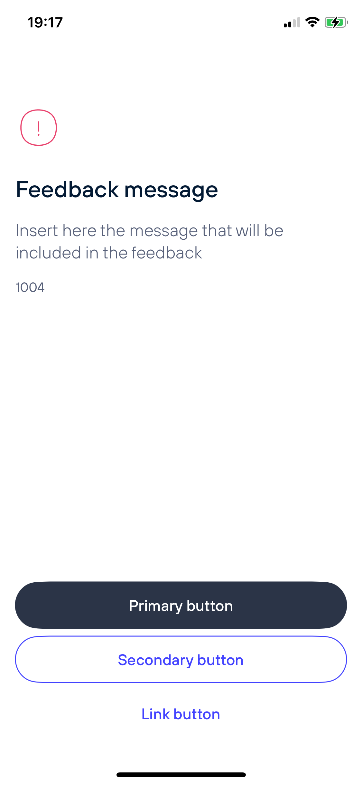
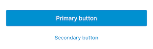

#  Feedbacks

The Feedback view will be in charge of rendering different types of feedbacks. Its content is customisable while the appearance is automatically configured per brand based on the selected feedback style. Background color, icon, animations, fonts and colors are predefined and can't be changed.


## Parameters

### Title and Subtitle

Multiline strings that will be positioned one below the other. If the content is large enough the view will scroll.

### Style

There are three fixed styles available: `.success`, `.informative` and `.error`. There's one custom style `.feedback(image)` that can be used to provide an icon that will be used instead of the fixed ones:

| Success     | Informative     | Error     | Feedback     |
|-------------|-----------------|-----------|-----------|
|  |  |  |  |

### Primary Button

For the primary action, a Feedback with a single primary button can be created: 

- **Button:**
```swift
Feedback(
    style: .informative,
    title: "Title",
    message: "Message"
) {
    Button("Primary") { ... }
}
```

### Button Action

For the secondary action, there are three different options: 

- **Button:** 
```swift
Feedback(
    style: .informative,
    title: "Title",
    message: "Message"
) {
    Button("Primary") { ... }
} secondaryButton: {
    Button("Secondary") { ... }
}
```
- **Link:** 
```swift
Feedback(
    style: .informative,
    title: "Title",
    message: "Message"
) {
    Button("Primary") { ... }
} linkButton: {
    Button("Secondary") { ... }
}
```
- **No button:**
```swift
Feedback(
    style: .informative,
    title: "Title",
    message: "Message"
) {
    Button("Primary") { ... }
}
```

| Button    | Link     | None |
|-------------|-----------------|-----------|
|  |   |  |

### Extra Content

An extra `View` can be provided to be placed below the subtitle. It will keep the same margins than the view above so no constraints should be required in order to properly align it with the rest of the content.

## Usage

Just create a `Feedback` with the required parameters. For example, a success feedback with a link secondary action and an extra view:

```swift
 Feedback(
     style: .informative,
     title: "Title",
     message: "Message"
 ) {
     VStack(alignment: .leading, spacing: 10) {
         Text("This extra view is optional")
             .font(.textPreset3(weight: .regular))
             .foregroundColor(.textPrimary)
         Text("Any UIView is allowed here")
             .font(.textPreset3(weight: .regular))
             .foregroundColor(.textPrimary)
         Text("It will always be placed below the subtitle")
             .font(.textPreset3(weight: .regular))
             .foregroundColor(.textPrimary)
         Text("It will be animated along the other text")
             .font(.textPreset3(weight: .regular))
             .foregroundColor(.textPrimary)
     }
 } primaryButton: {
     Button("Primary") { }
 } linkButton: {
     Button("Secondary") { }
 }
```
