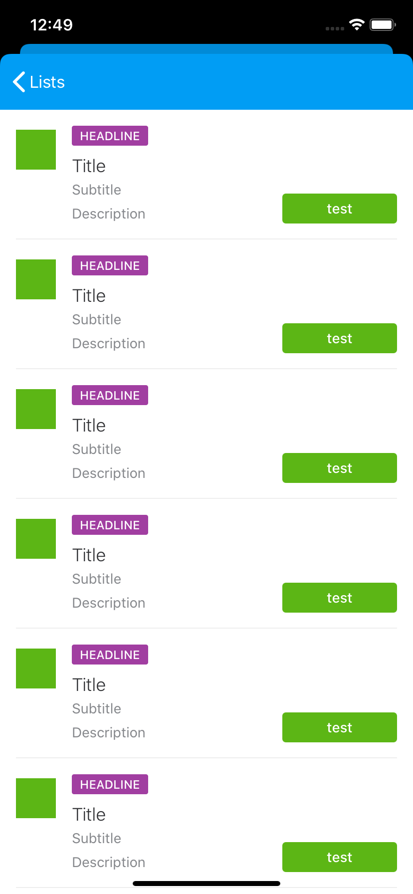
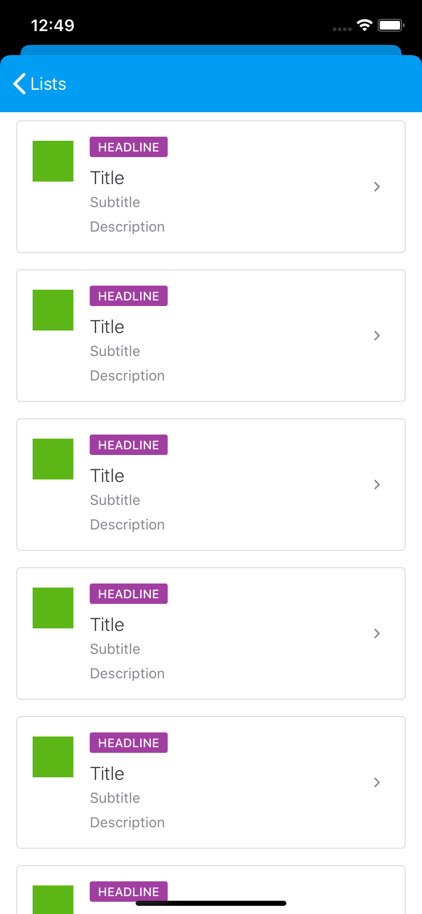
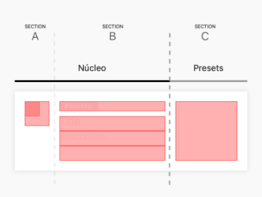

#  List

Lists are continous group of text with images and/or controls. We currently provide a view `Cell` and a view modifier for `List` `.misticaListStyle()`.

Lists has two styles of cells `FullWidth` and `Boxed`.

| FullWidth   |      Boxed      |
|----------|:-------------:|
|  |   |


#  Cell

`Cell` has the following anatomy

<p align="center">
  
</p>

* **Section A** contains an asset, which can be configured with one of the following three styles:
	- **Small icon**: 24x24 icon.
	- **Large icon**: 40x40 icon centered on a circle with 40px diameter and a provided background color.
	- **Image**: an image clipped to a circle with 40px diameter.
* **Section B** contains the following elements (described form top to down)
	* A headline section which can be customized with any kind of `UIView`
	* Title: non optional
	* Subtitle: optional
	* Description: optional
* **Section C** can be configured with any kind of UIView.

## Usage

Use `List` and add the Mistica style modifier.

```swift
NavigationView {
    List {
        ForEach(0..<10) {
            Cell(style: .boxed, title: "Title", subtitle: "subtitle")
        }
    }
    .misticaListStyle()
}
```

The last cell on a Mistica List should not have a divider. Use the modifier (`shouldShowDivider(<condition to match last item>)`) to hide it. E.g.:

```swift
    ForEach(rows) { row in
        Cell(
            ...
        )
        .shouldShowDivider(row != rows.last)
    }
```

#### Control Customization

`Cell` can be configured with a custom control like a `Toggle`.

```swift
NavigationView {
    List {
        ForEach(0..<10) {
            Cell(
                style: .fullwidth, 
                title: "Title", 
                subtitle: "subtitle", 
                assetType: .image(photo), 
                presetView: { 
                    Toggle("", isOn: $isEnabled)
                }
            )
        }
    }
    .misticaListStyle()
}
```

`Cell` can be configured with a headline view as well, for example, a `Tag`.

```swift
NavigationView {
    List {
        ForEach(0..<10) {
            Cell(
                style: .fullwidth, 
                title: "Title", 
                subtitle: "subtitle", 
                assetType: .image(photo), 
                headlineView: { 
                    Tag(style: .promo, text: "TAG LABEL")
                }
            )
        }
    }   
    .misticaListStyle()
}
```

The view asigned to `controlView` is added in a horizontal `HStack` with a fill distribution and the custom view is aligned to the top. The view will be stretched filling the available height space determined by the elements in the **Section B**.

We provide a preset custom control.

* **CellNavigationPreset**, a custom preset control for rows that navigate and need a badge view.

