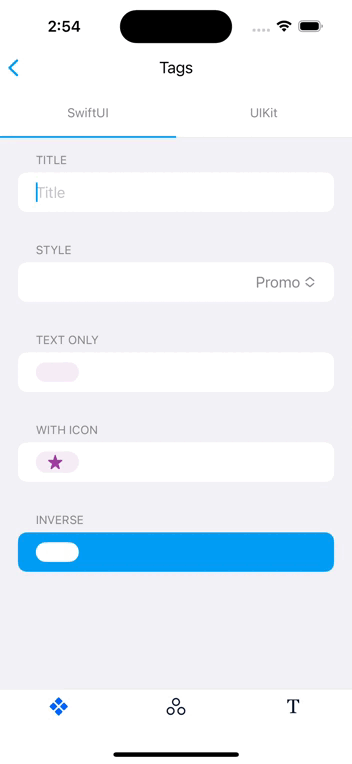

# Tag

This view consists of a label to display text with a defined style. It is also known as _Promotional Tag_.


## Usage

The view can be used in any SwiftUI hierarchy through the class constructor.

```swift
Tag(
    style: Tag.Style.promo,
    text: "Lorem ipsum",
    icon: Image(systemName: "star.fill")
)
```

The `Tag` component accepts the following parameters:
- `style`: The style will change the background and foreground color of the `Tag`. You can choose between following styles: promo, active, inactive, success, warning, error and inverse.
- `text`: Content which will be presented inside of the `Tag` as capitalized with center text alignment.
- `icon`: An icon send as `Image` can be added to the `Tag` component.



## Accessibility

The `Tag` is responsive to dynamic type changes so its internal label will increase/decrease the whole component when that value changes.
